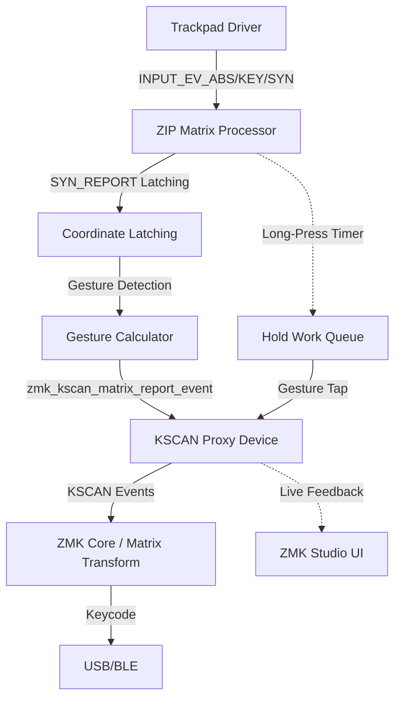

# ZIP Matrix (ZMK Input Processor Matrix)

A trackpad-to-matrix gesture driver for ZMK. This module converts absolute trackpad coordinates into virtual grid events compatible with ZMK's KSCAN interface and ZMK Studio.

## Architecture



## Configuration (DeviceTree)

### Input Processor

```dts
&trackpad_listener {
    input-processors = <&zip_matrix>;
};

zip_matrix: zip_matrix {
    compatible = "zmk,input-processor-matrix";
    #input-processor-cells = <0>;
    rows = <3>;
    columns = <3>;
    x = <1024>;
    y = <1024>;
    flick-threshold = <50>;
    kscan = <&kscan_gesture>;
    long-press-ms = <300>;
    suppress-abs = <false>;
    suppress-key = <false>;
};
```

### KSCAN Proxy

```dts
kscan_gesture: kscan_gesture {
    compatible = "zmk,kscan-input-matrix";
    #kscan-cells = <2>;
    rows = <15>;         /* (5 gestures * 3 rows) */
    columns = <3>;
};
```

## Gesture Blocks

The virtual matrix is divided into 5 vertical blocks:

| Block Index | Gesture Type | Row Offset |
|-------------|--------------|------------|
| 0           | Tap          | 0          |
| 1           | Flick Up     | rows * 1   |
| 2           | Flick Down   | rows * 2   |
| 3           | Flick Left   | rows * 3   |
| 4           | Flick Right  | rows * 4   |

### Example: Point (1,1) on a 3x3 Grid

- **Tap**: Row 1, Column 1
- **Flick Up**: Row 4, Column 1 (3 + 1)
- **Flick Right**: Row 13, Column 1 (12 + 1)

## Data Flow & Thread Safety

1. **Event Capture**: `zip_matrix_handle_event` intercepts trackpad events (`INPUT_EV_ABS`, `INPUT_EV_KEY`, `INPUT_EV_SYN`).
2. **SYN Latching**: Coordinates are buffered on ABS events and latched on `INPUT_SYN_REPORT` to ensure stable start positions after touch-down.
3. **Spinlocks**: `k_spinlock` is used across coordinate calculations and state management to prevent race conditions between interrupt-driven input reports and long-press work-queue items.
4. **Gesture Detection**: On touch release, displacement (dx, dy) is compared against `flick-threshold` to determine gesture type.
5. **Long-Press Timer**: A delayed work queue triggers hold events if the finger remains stationary beyond `long_press_ms`. Movement exceeding the threshold cancels the timer.
6. **Reporting**: Events are sent via `zmk_kscan_matrix_report_event`, which routes them to the `kscan_gesture` proxy. The KSCAN proxy checks `enabled` state before forwarding callbacks.

## Event Processing Flow

```
BTN_TOUCH (pressed)
  → sync_start_pending = true
  → is_holding = false

INPUT_EV_ABS (X/Y updates)
  → buffer current_x, current_y
  → update last_x, last_y
  → cancel hold timer if movement >= flick_threshold

INPUT_SYN_REPORT
  → latch start_x = current_x, start_y = current_y
  → latch last_x = current_x, last_y = current_y
  → sync_start_pending = false
  → start hold timer (if long_press_ms > 0)

BTN_TOUCH (released)
  → cancel hold timer
  → if holding: send release event only
  → else: calculate gesture → send press + release
```

## Development Standards

- **Internal Property**: Use `columns` (not `cols`) to align with `zmk,kscan-composite` and `zmk,matrix-transform`.
- **Function Prefix**: `zip_matrix_` for processor logic, `kscan_matrix_` for proxy logic.
- **ZMK Studio**: Ensuring 3x3 or consistent grid layouts allows ZMK Studio to visualize gestures intuitively.
- **Thread Safety**: All shared state is protected by `k_spinlock`. Event reporting happens outside the lock.
- **ZMK Module Standard**: Follows `zmkfirmware/zmk-module-template` structure with `zephyr_library_sources_ifdef()` for conditional compilation.
