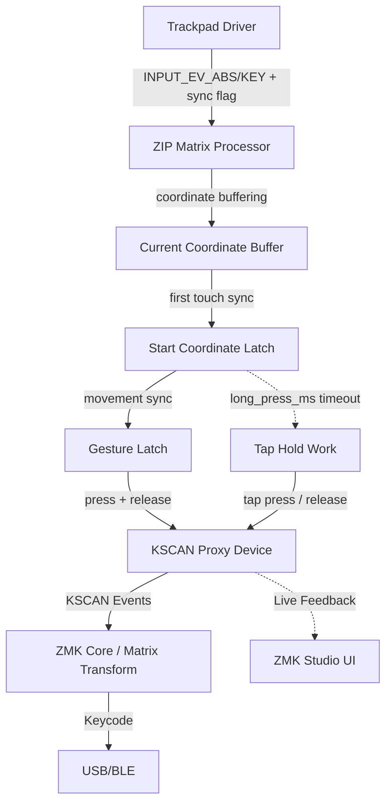

# ZIP Matrix (ZMK Input Processor Matrix)

A trackpad-to-matrix gesture driver for ZMK. This module converts absolute trackpad
coordinates into virtual grid events compatible with ZMK's KSCAN interface and
ZMK Studio.

## Architecture


```mermaid
graph TD
    TP[Trackpad Driver] -->|INPUT_EV_ABS/KEY + sync flag| ZIP[ZIP Matrix Processor]
    ZIP -->|coordinate buffering| BUF[Current Coordinate Buffer]
    BUF -->|first touch sync| START[Start Coordinate Latch]
    START -->|movement sync| GEST[Gesture Latch]
    START -.->|long_press_ms timeout| HOLD[Tap Hold Work]
    GEST -->|press + release| KP[KSCAN Proxy Device]
    HOLD -->|tap press / release| KP
    KP -->|KSCAN Events| ZMK[ZMK Core / Matrix Transform]
    ZMK -->|Keycode| US[USB/BLE]
    KP -.->|Live Feedback| STU[ZMK Studio UI]
```

## Configuration (DeviceTree)

### Input Processor

```dts
&trackpad_listener {
    input-processors = <&zip_matrix>;
};

zip_matrix: zip_matrix {
    compatible = "zmk,input-processor-matrix";
    #input-processor-cells = <0>;
    rows = <3>;
    columns = <3>;
    x = <1024>;
    y = <1024>;
    flick-threshold = <50>;
    kscan = <&kscan_gesture>;
    long-press-ms = <300>;

    /* Optional booleans: choose the narrowest suppression that matches the pipeline. */
    /* suppress-abs; */
    /* suppress-touch; */
    /* suppress-key; */
};
```

### KSCAN Proxy

```dts
kscan_gesture: kscan_gesture {
    compatible = "zmk,kscan-input-matrix";
    #kscan-cells = <2>;
    rows = <15>;         /* 5 gestures * 3 rows */
    columns = <3>;
};
```

## Gesture Blocks

The virtual matrix is divided into 5 vertical blocks:

| Block Index | Gesture Type | Row Offset |
|-------------|--------------|------------|
| 0           | Tap          | rows * 0   |
| 1           | Flick Up     | rows * 1   |
| 2           | Flick Down   | rows * 2   |
| 3           | Flick Left   | rows * 3   |
| 4           | Flick Right  | rows * 4   |

Example for point `(1,1)` on a 3x3 grid:

- Tap: row 1, column 1
- Flick Up: row 4, column 1
- Flick Right: row 13, column 1

## Data Flow & Thread Safety

1. Event capture: `zip_matrix_handle_event` observes `INPUT_EV_ABS` and `INPUT_EV_KEY`. `suppress-abs` consumes every `INPUT_EV_ABS` event after internal state is updated. `suppress-touch` consumes only `INPUT_BTN_TOUCH`. `suppress-key` consumes every `INPUT_EV_KEY` event, including touchpad button gestures.
2. Coordinate buffering: `INPUT_ABS_X` and `INPUT_ABS_Y` update `current_x/current_y`. Completed contacts reset these fields to `COORD_UNINITIALIZED` so the next touch cannot latch stale coordinates.
3. Start latching: the first sync while touch is active latches `start_x/start_y`, but only after both coordinates are initialized. If no coordinates arrive, no gesture is emitted.
4. Flick latching: after the start point is latched, each sync compares displacement against `flick-threshold`. The first threshold crossing latches the flick direction and cancels the pending tap-hold timer.
5. Tap hold: if no flick is latched before `long_press_ms`, delayed work presses the Tap cell at the start coordinate. The hold stays pressed until release.
6. Race handling: each touch has a `contact_id`. If release or the next touch happens while hold work is between state update and press reporting, `hold_release_pending` makes the work emit the release immediately after the press, exactly once, without clearing state for a newer touch.
7. Locking rule: shared state is protected by `k_spinlock`, but KSCAN reporting and work scheduling/cancellation happen outside the spinlock.

## Event Processing Flow

```text
BTN_TOUCH pressed
  - Treat only the OFF-to-ON transition as a new contact; repeated ON reports do not reset the active contact.
  - Cancel any pending hold work from an old contact.
  - If an old reported hold is still down, release it.
  - Increment contact_id so old hold work cannot clear this new contact.
  - Mark touch active.
  - Clear start_x/start_y, flick_latched, and flick_gesture.
  - Keep current_x/current_y, because the same report may have delivered ABS before BTN_TOUCH.

INPUT_EV_ABS X/Y
  - Clamp and buffer current_x/current_y.

Sync while touch is active
  - If start is unset and both coordinates are initialized:
      latch start_x/start_y from current_x/current_y.
      schedule tap-hold work when long_press_ms > 0.
  - Else if start is set, no hold is active, and no flick is latched:
      compare current - start with flick-threshold.
      on first threshold crossing, latch flick direction and cancel tap-hold work.

Tap-hold timeout
  - If touch is still active, start is set, and no flick is latched:
      press the Tap block cell calculated from start_x/start_y.
      mark hold_reported after the press report is sent.
  - If release raced with the press report:
      send the matching release immediately after the press.

BTN_TOUCH released, then sync
  - Cancel tap-hold work.
  - If a hold press was already reported:
      release that held Tap cell.
  - Else if hold work already claimed the hold but has not reported press yet:
      set hold_release_pending and let the work send press then release.
  - Else if a flick was latched:
      report the latched flick as press + release at the start coordinate.
  - Else:
      classify final displacement; below threshold reports Tap as press + release.
  - Reset start_x/start_y and current_x/current_y after the contact completes.

Sync while touch is inactive and no contact is active
  - Clear any buffered coordinates to prevent stale start latching on the next touch.
```

## Configuration Limits

- `rows`: 1 to 51
- `columns`: 1 to 255
- `x` / `y`: 1 to 65534
- `flick-threshold`: 1 to 65535
- `long-press-ms`: 0 to 65535
- The paired KSCAN node must use `rows = 5 * zip_matrix.rows` and matching `columns`.
- Init priority follows KSCAN automatically: the KSCAN proxy uses `CONFIG_KSCAN_INIT_PRIORITY`, and the input processor initializes at `CONFIG_KSCAN_INIT_PRIORITY + 1` via `UTIL_INC()`. Reports are ignored until the KSCAN proxy is ready and enabled.

## Development Standards

- Internal property: use `columns`, not `cols`, to align with `zmk,kscan-composite` and `zmk,matrix-transform`.
- Function prefix: `zip_matrix_` for processor logic, `kscan_matrix_` for proxy logic.
- ZMK Studio: consistent grids such as 3x3 allow ZMK Studio to visualize gestures intuitively.
- Thread safety: event reporting and work scheduling/cancellation stay outside `k_spinlock`.
- ZMK module standard: follows `zmkfirmware/zmk-module-template` structure with `zephyr_library_sources_ifdef()` for conditional compilation.
