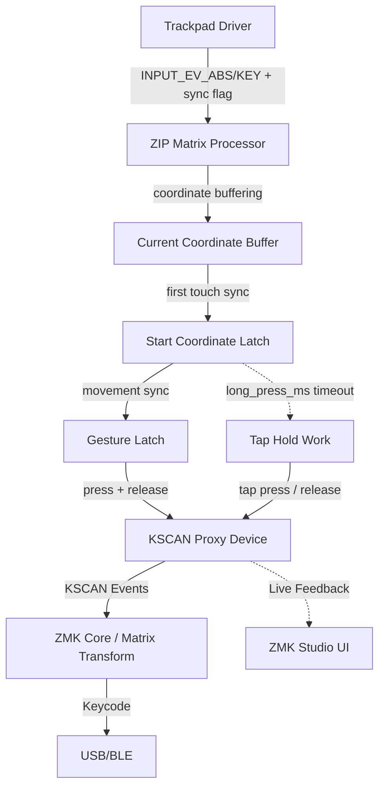

# ZIP Matrix (ZMK Input Processor Matrix)

A trackpad-to-matrix gesture driver for ZMK. This module converts absolute trackpad
coordinates into virtual grid events compatible with ZMK's KSCAN interface and
ZMK Studio.

## Architecture


```mermaid
graph TD
    TP[Trackpad Driver] -->|INPUT_EV_ABS/KEY + sync flag| ZIP[ZIP Matrix Processor]
    ZIP -->|coordinate buffering| BUF[Current Coordinate Buffer]
    BUF -->|first touch sync| START[Start Coordinate Latch]
    START -->|movement sync| GEST[Gesture Latch]
    START -.->|long_press_ms timeout| HOLD[Tap Hold Work]
    GEST -->|press + release| KP[KSCAN Proxy Device]
    HOLD -->|tap press / release| KP
    KP -->|KSCAN Events| ZMK[ZMK Core / Matrix Transform]
    ZMK -->|Keycode| US[USB/BLE]
    KP -.->|Live Feedback| STU[ZMK Studio UI]
```

## Configuration (DeviceTree)

### Input Processor

```dts
&trackpad_listener {
    input-processors = <&zip_matrix>;
};

zip_matrix: zip_matrix {
    compatible = "zmk,input-processor-matrix";
    #input-processor-cells = <0>;
    rows = <3>;
    columns = <3>;
    x = <1024>;
    y = <1024>;
    flick-threshold = <50>;
    kscan = <&kscan_gesture>;
    long-press-ms = <300>;

    /* Optional booleans: choose the narrowest suppression that matches the pipeline. */
    /* suppress-abs; */
    /* suppress-touch; */
    /* suppress-key; */
};
```

### KSCAN Proxy

```dts
kscan_gesture: kscan_gesture {
    compatible = "zmk,kscan-input-matrix";
    #kscan-cells = <2>;
    rows = <15>;         /* 5 gestures * 3 rows */
    columns = <3>;
};
```

## Gesture Blocks

The virtual matrix is divided into 5 vertical blocks:

| Block Index | Gesture Type | Row Offset |
|-------------|--------------|------------|
| 0           | Tap          | rows * 0   |
| 1           | Flick Up     | rows * 1   |
| 2           | Flick Down   | rows * 2   |
| 3           | Flick Left   | rows * 3   |
| 4           | Flick Right  | rows * 4   |

Example for point `(1,1)` on a 3x3 grid:

- Tap: row 1, column 1
- Flick Up: row 4, column 1
- Flick Right: row 13, column 1

## Data Flow & Thread Safety

1. Event capture: `zip_matrix_handle_event` observes `INPUT_EV_ABS` and `INPUT_EV_KEY`. `suppress-abs` consumes every `INPUT_EV_ABS` event after internal state is updated. `suppress-touch` consumes only `INPUT_BTN_TOUCH`. `suppress-key` consumes every `INPUT_EV_KEY` event, including touchpad button gestures.
2. Coordinate buffering: `INPUT_ABS_X` and `INPUT_ABS_Y` update `current_x/current_y`. Completed contacts reset these fields to `COORD_UNINITIALIZED` so the next touch cannot latch stale coordinates.
3. Start latching: the first sync while touch is active latches `start_x/start_y`, but only after both coordinates are initialized. If no coordinates arrive, no gesture is emitted.
4. Flick qualification: after the start point is latched, each sync compares squared travel against the squared threshold. Travel is true distance, so the boundary is a circle. The first crossing cancels the pending tap-hold timer; the contact keeps being tracked afterwards and the direction is re-read whenever a farther point is reached, so the reported direction comes from the longest vector of the stroke rather than the shortest one.
5. Tap hold: if no flick qualifies before `long_press_ms`, delayed work presses the Tap cell at the start coordinate. The hold stays pressed until release, or until the layer changes.
6. Race handling: each touch has a `contact_id`. If release or the next touch happens while hold work is between state update and press reporting, `hold_release_pending` makes the work emit the release immediately after the press, exactly once, without clearing state for a newer touch.
7. Locking rule: shared state is protected by `k_spinlock`, but KSCAN reporting and work scheduling/cancellation happen outside the spinlock.
8. Workqueue assumption: `hold_work_handler` reports its press between two critical sections. The state it leaves behind is only consistent because nothing else runs in that gap - the work is on the system workqueue, which is cooperative (`CONFIG_SYSTEM_WORKQUEUE_PRIORITY` is negative), while the input thread that calls `handle_event` is preemptible, and the report itself only queues a message and never yields. A preemptible system workqueue would break this.
9. Layer changes: the chain is selected per event from the layer active at that moment, so one contact can be split across two chains and the `BTN_TOUCH` release routed elsewhere. `zmk_layer_state_changed` is subscribed directly - a reported hold is released, a pending hold is cancelled, the suppression record is cleared, and `contact_id` is incremented so hold work already past its spin lock cannot claim the contact.

## Event Processing Flow

```text
BTN_TOUCH pressed
  - Treat only the OFF-to-ON transition as a new contact; repeated ON reports do not reset the active contact.
  - Cancel any pending hold work from an old contact.
  - If an old reported hold is still down, release it.
  - Increment contact_id so old hold work cannot clear this new contact.
  - Mark touch active.
  - Clear start_x/start_y, flick_latched, and flick_gesture.
  - Keep current_x/current_y, because the same report may have delivered ABS before BTN_TOUCH.

INPUT_EV_ABS X/Y
  - Clamp and buffer current_x/current_y.

Sync while touch is active
  - If start is unset and both coordinates are initialized:
      latch start_x/start_y from current_x/current_y.
      schedule tap-hold work when long_press_ms > 0.
  - Else if start is set, flicks are enabled, and no hold owns this contact:
      compare squared travel of (current - start) with the squared threshold.
      if it qualifies and exceeds the farthest travel so far:
        cancel tap-hold work on the first qualification only.
        record the new farthest travel and re-read the direction from it.

Tap-hold timeout
  - If touch is still active, start is set, and no flick is latched:
      press the Tap block cell calculated from start_x/start_y.
      mark hold_reported after the press report is sent.
  - If release raced with the press report:
      send the matching release immediately after the press.

BTN_TOUCH released, then sync
  - Cancel tap-hold work.
  - If a hold press was already reported:
      release that held Tap cell.
  - Else if hold work already claimed the hold but has not reported press yet:
      set hold_release_pending and let the work send press then release.
  - Else if a flick was latched:
      report the latched flick as press + release at the start coordinate.
  - Else:
      classify final displacement; below threshold reports Tap as press + release.
  - Reset start_x/start_y and current_x/current_y after the contact completes.

Sync while touch is inactive and no contact is active
  - Clear any buffered coordinates to prevent stale start latching on the next touch.

Layer changed
  - Release a cell this instance has already pressed.
  - Cancel a hold that is only pending, so it cannot fire after the change.
  - Clear start/flick state and the suppressed-button record.
  - Increment contact_id so in-flight hold work cannot claim this contact.
```

## Configuration Limits

- `rows`: 1 to 51
- `columns`: 1 to 255
- `x` / `y`: 1 to 65534
- `flick-threshold`: 1 to 65535
- `long-press-ms`: 0 to 65535
- The paired KSCAN node must use matching `columns` and `rows = zip_matrix.rows * gestures`, where `gestures` is 5 normally and 1 with `diamond-tap`.
- Init priority follows KSCAN automatically: the KSCAN proxy uses `CONFIG_KSCAN_INIT_PRIORITY`, and the input processor initializes at `CONFIG_KSCAN_INIT_PRIORITY + 1` via `UTIL_INC()`. Reports are ignored until the KSCAN proxy is ready and enabled.

## Diamond-Tap Mode

When `diamond-tap;` is set on a 1×4 grid, Tap gestures use diagonal
partitioning instead of the regular rectangular grid. Two diagonals divide
the touch area into four triangles:

```text
 (0,0)---------------(x,0)
   | \      Up       / |
   |   \   col 0   /   |
   |     \       /     |
   |       \   /       |
   | Left    X   Right |
   | col 3 /   \ col 1 |
   |     /       \     |
   |   /   Down    \   |
   | /     col 2     \ |
 (0,y)---------------(x,y)
```

The calculation chooses the nearest cardinal key center after normalizing the
touch area. Equivalently, it compares the distance from the center on each axis:

```text
dx = 2 * px - x
dy = 2 * py - y

vertical when |dy| / y >= |dx| / x
```

| Column | Quadrant | Condition (normalised) |
|--------|----------|----------------------|
| 0      | Up       | vertical ∧ dy < 0    |
| 1      | Right    | horizontal ∧ dx >= 0 |
| 2      | Down     | vertical ∧ dy >= 0   |
| 3      | Left     | horizontal ∧ dx < 0  |

Points on a diagonal boundary prefer the vertical axis, so exact center maps to
Down.

A diamond instance reports **taps only**. The diamond takes its direction from
where the finger comes to rest, which is the opposite of what a flick measures:
on a pad this small a stroke has to begin on the far side of the one it travels
towards, leaving the two readings pointing opposite ways. `get_gesture_type`
therefore returns `GESTURE_TAP` unconditionally for such an instance, the four
flick rows are never reached, and `ZIP_MATRIX_GESTURE_ROWS` drops to 1 so the
kscan proxy behind it carries one row per grid row instead of five.

`flick-threshold` is still required by the binding but is inert here.

### Example Configuration

```dts
kscan_gesture: kscan_gesture {
    compatible = "zmk,kscan-input-matrix";
    rows = <1>;      /* 1 gesture (Tap) * 1 row */
    columns = <4>;
};

zip_matrix: zip_matrix {
    compatible = "zmk,input-processor-matrix";
    rows = <1>;
    columns = <4>;
    x = <1024>;
    y = <1024>;
    flick-threshold = <50>;
    long-press-ms = <200>;
    diamond-tap;
    kscan = <&kscan_gesture>;
};
```

### Keymap Layout

```text
row 0: Tap diamond   → col 0=Up, col 1=Right, col 2=Down, col 3=Left
```

That is the whole matrix - a diamond instance has no flick rows.

## Development Standards

- Internal property: use `columns`, not `cols`, to align with `zmk,kscan-composite` and `zmk,matrix-transform`.
- Function prefix: `zip_matrix_` for processor logic, `kscan_matrix_` for proxy logic.
- ZMK Studio: consistent grids such as 3x3 allow ZMK Studio to visualize gestures intuitively.
- Thread safety: event reporting and work scheduling/cancellation stay outside `k_spinlock`.
- ZMK module standard: follows `zmkfirmware/zmk-module-template` structure with `zephyr_library_sources_ifdef()` for conditional compilation.
